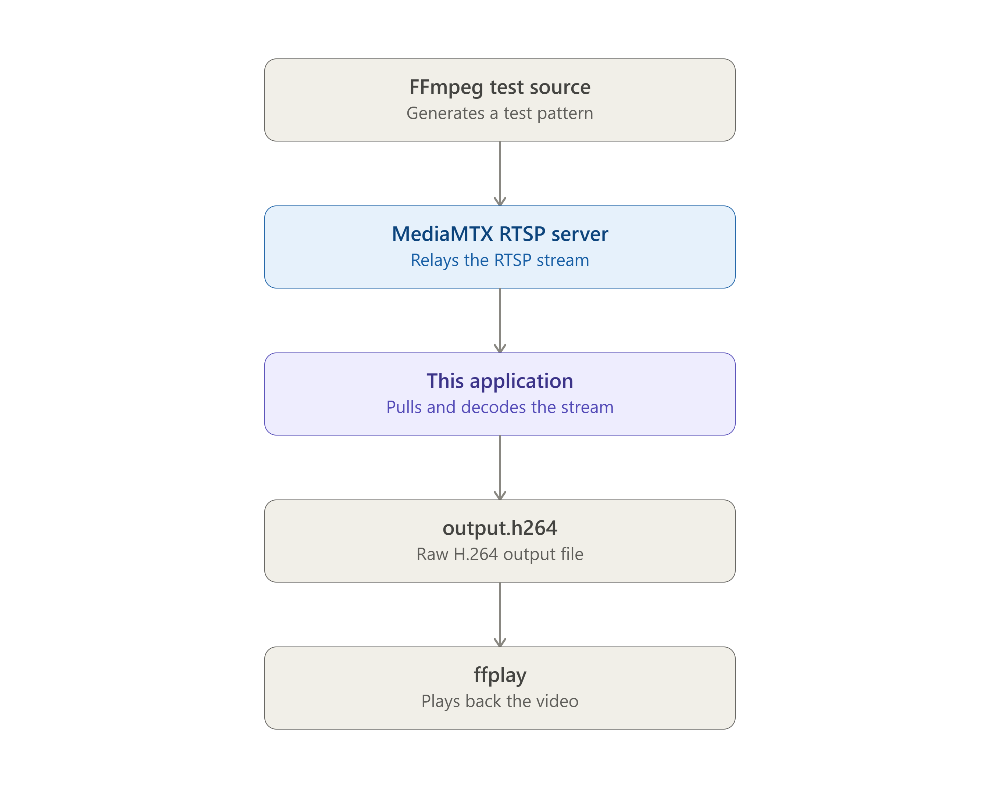
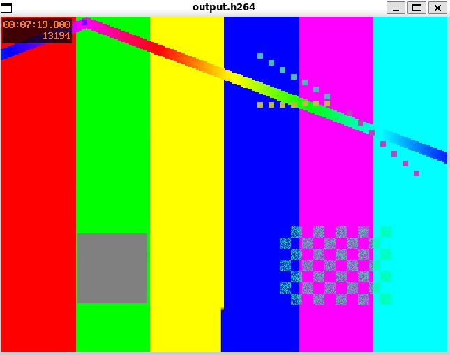

# Overview

This project implements a small RTSP client from scratch to understand the underlying protocols.
Rust for implementing core RTSP/RTP packet parser, MediaMTX for video source RTSP streaming, FFMpeg for media support.

## Goal

The complete media flow is:


The application:
1. performs the RTSP handshake;
2. receives RTP/RTCP interleaved frames over the RTSP TCP connection;
3. parses RTP packets;
4. depacketizes H.264 Single NAL, STAP-A, and FU-A payloads;
5. writes an Annex B H.264 bitstream to `output.h264`.

## Prerequisites

- WSL2 Ubuntu 24.04

You can install dependencies by running below command
```bash
sudo apt update
sudo apt install ffmpeg
curl --proto '=https' --tlsv1.2 -sSf https://sh.rustup.rs | sh
```

## Experiment

Run the MediaMTX server and FFmpeg test publisher
```bash
docker compose up -d
```

> You can confirm that FFmpeg is publishing an H.264 stream to MediaMTX
> ```bash
> rustsp-publisher  | Output #0, rtsp, to 'rtsp://mediamtx:8554/test':
> rustsp-publisher  |   Metadata:
> rustsp-publisher  |     encoder         : Lavf62.12.102
> rustsp-publisher  |   Stream #0:0: Video: h264, yuv420p(tv, progressive), 640x480 [SAR 1:1 DAR 4:3], q=2-31, 30 fps, 90k tbn
> rustsp-publisher  |     Metadata:
> rustsp-publisher  |       encoder         : Lavc62.28.102 libx264
> rustsp-publisher  |     Side data:
> rustsp-publisher  |       CPB properties: bitrate max/min/avg: 0/0/0 buffer size: 0 vbv_delay: N/A
> ```

Run the custom RTSP client and collect RTP media
```bash
RUSTSP_MEDIA=1 cargo run
```

After the client receives and depacketizes the RTP stream, you can play the generated H.264 bitstream
```bash
ffplay output.h264
```

## Result

